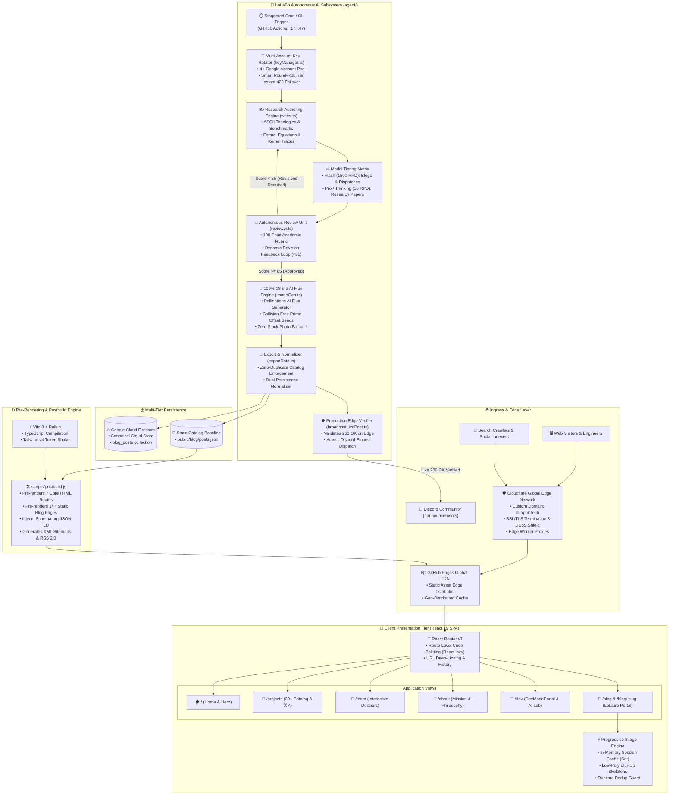
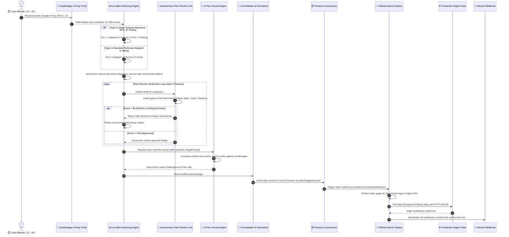
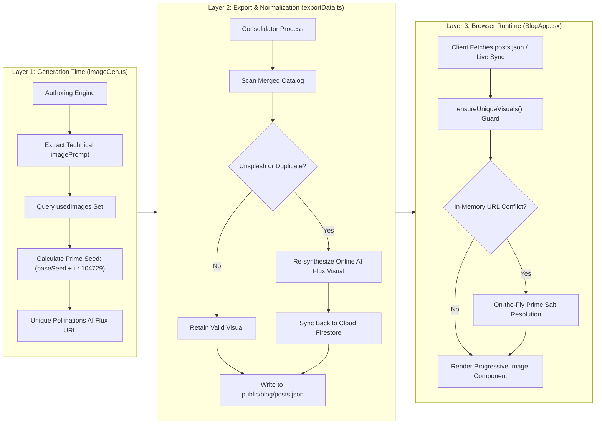

# 🧬 Lorapok Labs — Digital Ecosystem & Developer Portal v2.0

[](https://github.com/Lorapok/lorapok.github.io/actions/workflows/deploy.yml)
[](https://github.com/Lorapok/lorapok.github.io/actions/workflows/lolabo-agent.yml)
[](https://lorapok.tech)
[](https://react.dev)
[](https://vitejs.dev)
[](https://www.typescriptlang.org/)
[](https://opensource.org/licenses/MIT)

**Lorapok Labs** is an open-source software collective focused on **Sensory Computing**, **Biological UI**, and **Autonomous AI Engineering**. This portal serves as the primary gateway for 30+ open-source tools, browser extensions, developer CLIs, and autonomous research publications across 7 global distribution platforms.

---

## 🏗️ System Architecture Topology

Lorapok Labs operates on a multi-tier distributed architecture spanning an edge ingress network, client-side sensory SPA, static pre-rendering build pipeline, and an autonomous AI systems research engine (**LoLaBo**).



---

## 🔄 LoLaBo Autonomous AI Publication Pipeline

The sequence diagram below illustrates the end-to-end autonomous research synthesis, peer-review refinement, online AI visual generation, and gated edge broadcast:



---

## 🛡️ Triple-Layer Visual Deduplication Architecture

To permanently guarantee that no two articles ever share the same visual and eliminate stock photography fallbacks, LoLaBo enforces a three-layer defense matrix:



---

## 🌐 The Multi-Page Architecture (v2.0)

Lorapok Labs v2.0 transitions the ecosystem from a single-page portfolio into a full-fledged, multi-page open-source product organization with route-level code splitting:

| Route | View Component | Key Architectural Capabilities |
| :--- | :--- | :--- |
| `/` | [`HomePage.tsx`](src/pages/HomePage.tsx) | Sensory hero, animated stats counter, 3-pillar philosophy, featured product spotlights. |
| `/projects` | [`ProjectsPage.tsx`](src/pages/ProjectsPage.tsx) | 30+ products across 10 categories, multi-criteria filtering, keyboard `⌘K` search overlay. |
| `/team` | [`TeamPage.tsx`](src/pages/TeamPage.tsx) | Interactive dossiers, skills matrices, career trajectories, and modal deep dives. |
| `/about` | [`AboutPage.tsx`](src/pages/AboutPage.tsx) | Organizational backstory, founder profile, design system manifesto, and ethics. |
| `/changelog` | [`ChangelogPage.tsx`](src/pages/ChangelogPage.tsx) | Chronological release milestones, semantic versions, and platform launch notes. |
| `/support` | [`SupportPage.tsx`](src/pages/SupportPage.tsx) | bKash funding channel, multi-chain crypto addresses, and backer recognition. |
| `/contact` | [`ContactPage.tsx`](src/pages/ContactPage.tsx) | Direct routing contact bridge for commercial inquiries, partnerships, and bug reports. |
| `/dev` | [`DevModePortal.tsx`](src/dev/DevModePortal.tsx) | Authenticated developer workspace, multi-provider AI lab, API playground, live system telemetry. |
| `/blog` | [`BlogApp.tsx`](src/blog/BlogApp.tsx) | LoLaBo research portal, category/format filters, progressive image caching, reading progress. |
| `/blog/:slug` | [`BlogApp.tsx`](src/blog/BlogApp.tsx) | Pre-rendered individual research treatise view, formal citations, LaTeX math, code highlighting. |

---

## 🔬 LoLaBo Autonomous AI Engine Specifications

### 1. Multi-Account Key Pool (`agent/keyManager.ts`)
Connects to multiple Google AI Studio accounts to multiply rate limits and ensure zero publication downtime:
- **Environment Key Matrix**: Accepts `GEMINI_API_KEYS="key1,key2,key3,key4"` or individual keys `GEMINI_API_KEY_1..4`.
- **Smart Failover**: Catches HTTP `429 Too Many Requests` or `RESOURCE_EXHAUSTED` responses, enters a cooldown state for the exhausted account, and automatically fails over to the next healthy account in $< 5\text{ ms}$.

### 2. Strict Model Tiering Policy
Enforces resource attribution based on intellectual complexity:
- **Gemini Flash (`gemini-2.5-flash`, `gemini-2.0-flash`)**: Reserved for high-velocity software engineering dispatches, changelogs, and ecosystem announcements.
- **Gemini Pro & Thinking (`gemini-2.5-pro`, `gemini-2.0-flash-thinking-exp`)**: Strictly mandated for research treatises, kernel deep-dives, formal specifications (RFCs), and mathematical algorithm analyses.

### 3. Autonomous Peer-Review Verification Unit (`agent/reviewer.ts`)
Audits all generated manuscripts against an academic 100-point rubric before publication:

| Evaluation Dimension | Weight | Acceptance Criteria |
| :--- | :---: | :--- |
| **Architectural Depth & Rigor** | **30 pts** | Kernel-level mechanics, memory alignments, cache hierarchy impacts, and invariants. |
| **Structural Completeness** | **25 pts** | ASCII topology diagrams, comparative benchmark matrices, and formal conclusion. |
| **Code & Mathematical Soundness** | **20 pts** | Idiomatic Rust/Go/C++ snippets, asymptotic complexity bounds ($O(n \log n)$). |
| **Citations & Literature Integrity** | **15 pts** | Inline citations referencing authoritative RFCs/papers, dedicated references section ($\ge 3$). |
| **Anti-Hallucination & Tone** | **10 pts** | Zero template placeholders (`TODO`, `TBD`), zero abrupt cutoffs, authoritative engineering voice. |

*Drafts scoring $< 85$ receive targeted critique prompts and enter an iterative revision cycle (up to 2 passes).*

### 4. Aggregate Publishing Capacity (4 Google Accounts + Free Mesh)

| Content Tier | 1 Google Account | 4 Google Accounts Pooled | With Free Provider Mesh (Groq / Cerebras) |
| :--- | :---: | :---: | :---: |
| **Standard Blogs & Dispatches** | 1,500 / day (62.5/hr) | **6,000 / day (250/hr)** | **20,000+ / day** |
| **Flagship Research & Thesis Papers** | 50 / day (2.08/hr) | **200 / day (8.33/hr)** | **500+ / day** |
| **Peer-Review Verification Passes** | 1,000 / day | **4,000 / day** | **10,000+ / day** |

---

## ⚡ Progressive Image Loading & Client Performance

All visual assets in the LoLaBo blog portal utilize [`LoLaBoImage.tsx`](src/blog/components/LoLaBoImage.tsx):
- **In-Memory Session Cache**: Tracks loaded images via `loadedImageCache: Set<string>`, eliminating network re-fetches during internal client navigation.
- **Low-Poly Blur-Up Skeletons**: Displays an animated SVG shimmer skeleton while assets decode.
- **Hero Image Prefetching**: Automatically prefetches hero images for the top articles upon initial portal hydration.
- **Deterministic AI Fallback**: If an image fails to load over the network, a dynamic vector SVG with technical glyphs and domain branding renders instantly.

---

## 🛠️ Static SEO Pre-Rendering Engine (`scripts/postbuild.js`)

To guarantee first-class indexability on search engines and instant social sharing previews without server-side rendering (SSR) overhead:
1. **Isolated Static HTML Routes**: Pre-renders separate `index.html` files for `/projects`, `/about`, `/team`, `/changelog`, `/support`, `/contact`, and `/dev`.
2. **Dedicated Article SEO Pages**: Generates static HTML folders for all 14+ research articles under `dist/blog/:slug/index.html`.
3. **Automated Metadata Injection**: Injects page-specific `<title>`, `<meta name="description">`, `og:image`, `twitter:card`, and canonical URLs.
4. **Structured Data (JSON-LD)**: Injects Schema.org `Article` and `Organization` structured data into every page's `<head>`.
5. **Sitemaps & RSS Feed**: Automatically synthesizes `public/sitemap.xml`, `public/blog/sitemap.xml`, and `public/blog/rss.xml`.

---

## 📂 Codebase Directory Topology

```text
lorapok.github.io/
├── agent/                         # LoLaBo Autonomous AI Subsystem
│   ├── index.ts                   # CLI entry point & publication orchestration
│   ├── server.ts                  # Autonomous daemon & REST API service
│   ├── writer.ts                  # Multi-model authoring engine & model tiering
│   ├── reviewer.ts                # Autonomous Research Review Unit (100-pt rubric)
│   ├── keyManager.ts              # 4-account Google AI key rotator & 429 failover
│   ├── imageGen.ts                # 100% online AI Flux engine & catalog normalizer
│   ├── exportData.ts              # Static data consolidator & Firestore synchronizer
│   ├── broadcastLivePost.ts       # Edge verification probe & Discord broadcaster
│   └── capacity.ts                # Multi-account publishing capacity analyzer
├── public/                        # Static Web Assets
│   ├── blog/
│   │   ├── posts.json             # Canonical static research catalog (14 articles)
│   │   ├── sitemap.xml            # Blog XML sitemap
│   │   └── rss.xml                # RSS 2.0 publication feed
│   ├── sitemap.xml                # Root website XML sitemap
│   └── robots.txt                 # Search engine crawler policies
├── scripts/                       # Build & Release Tooling
│   └── postbuild.js               # Static HTML pre-renderer & SEO tag injector
├── src/                           # React 19 Client SPA Source
│   ├── blog/                      # LoLaBo Research Portal
│   │   ├── BlogApp.tsx            # Main blog application & visual dedup guard
│   │   └── components/            # Blog components (LoLaBoImage, CodeBlocks, etc.)
│   ├── components/                # Shared UI Components (Navbar, Footer, Search)
│   ├── data/                      # Structured Ecosystem Data
│   │   ├── lorapok.ts             # 30+ products, categories, and brand metadata
│   │   ├── team.ts                # Core team profiles & interactive dossiers
│   │   └── changelog.ts           # Ecosystem version milestones
│   ├── dev/                       # Developer Workspace & AI Playground
│   ├── pages/                     # Core Route Page Views
│   └── styles/                    # Tailwind CSS v4 & custom design tokens
├── .github/workflows/             # Continuous Integration & Automation
│   ├── lolabo-agent.yml           # Twice-hourly autonomous research publisher
│   └── deploy.yml                 # Automated edge build & GitHub Pages deploy
└── package.json                   # Project dependencies & operational scripts
```

---

## 🚀 Marketplace Distribution & Ecosystem Presence

Lorapok products are distributed across 7 major software registries:

* **VS Code Marketplace:** [LorapokLabs](https://marketplace.visualstudio.com/publishers/LorapokLabs) — *Cursor Curse Monitor, Lorapok Atlas*
* **Open VSX Registry:** [LorapokLabs](https://open-vsx.org/namespace/LorapokLabs) — *Cursor Curse Monitor, Lorapok Atlas*
* **Firefox AMO:** [Lorapok Add-ons](https://addons.mozilla.org/firefox/user/lorapok/) — *Atlas API Directory, XSnap Media Downloader, SubtitleMaster*
* **npm Registry:** `@lorapok-labs/reportkit-ui`, `lorapok-atlas`, `lorapok-atlas-mcp`, `roast-api`, `lorapok-player`
* **PyPI:** `roast-api`
* **Packagist:** `lorapok/laravel-execution-monitor`, `maizied/roast-api`
* **Snapcraft:** `lorapokmediaplayer`
* **Product Hunt:** [Lorapok Atlas Launch](https://www.producthunt.com/posts/lorapok-atlas)

---

## ⚙️ Development & Operational Commands

```bash
# Clone the repository
git clone https://github.com/Lorapok/lorapok.github.io.git
cd lorapok.github.io

# Install client and agent dependencies
npm install
cd agent && npm install && cd ..

# Start local sensory development server
npm run dev

# Run type checking across client application
npx tsc --noEmit

# Compile agent TypeScript modules to CommonJS
npm run agent:build

# Execute full production build with static HTML SEO pre-rendering
npm run build

# Run LoLaBo autonomous publisher manually (single dispatch)
npm run agent:dispatch

# Start LoLaBo autonomous daemon service
npm run service:lolabo:daemon
```

---

## 🔐 Zero-Trust Governance & Credentials

In accordance with Loragent Governance Standards:
- Plaintext secrets, private keys, and passphrases are never committed to Git, passed via argv, or exposed in client bundles.
- Production credentials are synchronised through the centralized machine AES-256 vault:
  ```bash
  cred get cloudflare account_id_lorapok
  cred get google_ai gemini_api_keys
  ```

---

## 📜 Team & License

Designed, engineered, and maintained by **[Mohammad Maizied Hasan Majumder (@Maijied)](https://github.com/Maijied)** and the **[Lorapok Labs](https://github.com/Lorapok)** open-source collective.

Released under the **[MIT License](LICENSE)**.
